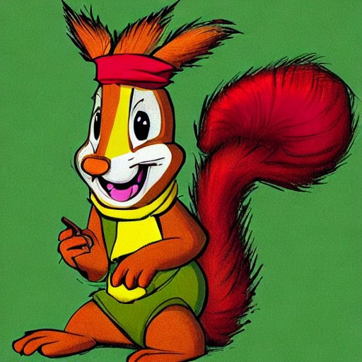
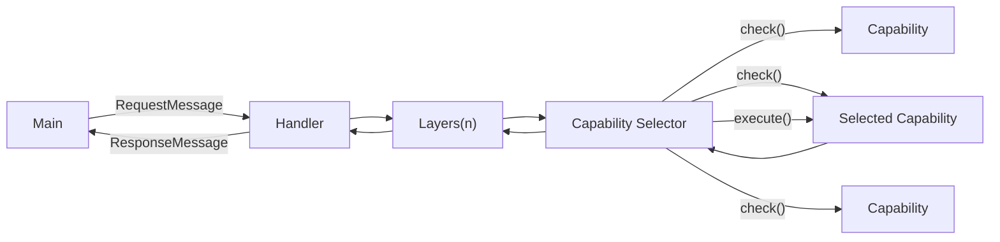
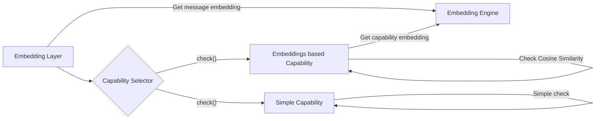

# Rustatoskr
Rustatoskr is a rewrite of Ratatoskr in Rust. Part of this was simply for research purposes to see the difference between the memory usage of a Go and Rust implementation of the same application. The other part was to see how much of a difference the type system makes in terms of code quality and readability.

Writing in rust also lets us make use of the advances in local AI that have been made that make use of native integration such as local tokenization which seem to be limited to python and rust at the moment.



## Continous dev:

### Windows
```powershell
$env:RUST_LOG="trace"; cargo watch -c -x run
```

### Linux
```sh
RUST_LOG=trace cargo watch -c -x run
```
## Architecture

### High level
Messages from telegram are converted to a RequestMessages and passed to the handler. The handler then passes the message through a series of layers that can either reject the message entirely or modify it and pass it to the next layer. The final layer is a capability selector that selects the capability that should handle the message. The capability is then executed and the response is passed back through the layers and back to the handler which then sends the response back to telegram.



#### Layers
By having messages pass through the layers in both directions, layers have the power to check, modify or even save responses from capabilities. This allows for things like security, caching, and logging.

#### Capabilities

Capabilities are the parts of the application that respond to the user. They provide an interface that allows them to implement a check function that returns a score for how well they can handle a message and an execute function that returns a response message. This allows for multiple capabilities to be registered and for the best one to be selected for each message.

Allowing the capabilites to calculate their own score allows for simple capabilities
that, for example do an exact match on a command, to be registered alongside more complex capabilities that use machine learning to determine if they can handle a message.

```rust
pub trait Capability {
    async fn check(&mut self, message: &RequestMessage) -> f32;
    async fn execute(&mut self, message: &RequestMessage) -> ResponseMessage;
}
```

### Specific implementation
While the high level architecture can be applied anywhere, the specific implementation in Rustatoskr makes use of a specific strategy involving an `EmbeddingLayer`.

#### EmbeddingLayer
The `EmbeddingLayer` is a layer that converts the message to a text embedding and attaches this embedding to the `RequestMessage`. This allows capabilities to make use of embeddings to to calculate a `check()` score using [cosine similarity](https://en.wikipedia.org/wiki/Cosine_similarity).



#### Embedding Engine
Currently Rustatoskr uses OpenAI's embeddings API with the `text-embedding-ada-002` model. Future plans inclide testing out local embeddings to see if this reduces overall cost or latency. 

## Todo
- [x] Move message embeddings to be a one off by creating an embedding layer
- [ ] Create description embeddings on registration of a new capability, possibly long term hashed for even fewer calls to the api
- [ ] Try find a way to do embeddings locally that doesn't crash async

